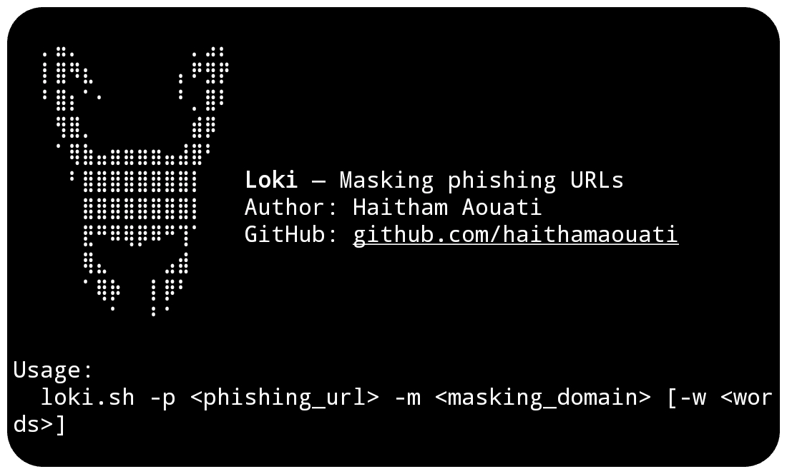

# Loki
**Loki** — Masking phishing URLs



## Install

To use the Loki script, follow these steps:

1. Clone the repository:

    ```
    git clone https://github.com/haithamaouati/Loki.git
    ```

2. Change to the Loki directory:

    ```
    cd Loki
    ```
    
3. Change the file modes
    ```
    chmod +x loki.sh
    ```
    
5. Run the script:

    ```
    ./loki.sh
    ```

## Usage
Usage: `./loki.sh -p <phishing_url> -m <masking_domain> [-w <words>]`

##### Options:

`-p`, `--phish`     Phishing URL (must start with http/https)

`-m`, `--mask`      Legit-looking domain to mask with

`-w`, `--words`     Social engineering words (no spaces, optional)

`-h`, `--help`      Show this help message and exit

##### Example:
`./loki.sh --phish https://phishing.com --mask https://example.com --words login-update
`

## Author

Made with :coffee: by **Haitham Aouati**
  - GitHub: [github.com/haithamaouati](https://github.com/haithamaouati)

## License

Loki is licensed under [Unlicense license](LICENSE)
